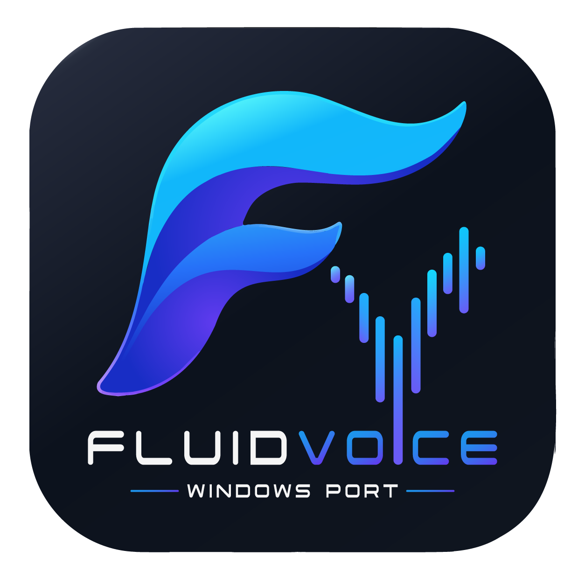

# FluidVoice for Windows

<p align="center">
  
</p>

Local **Windows** voice-to-text dictation app. Hold a global hotkey, speak, release — text is transcribed on-device and inserted into the focused application.

This repository is a **Flutter + native C++ Windows port**. The original FluidVoice macOS app (Swift) remains in-tree as reference only and is **not** what you build or run on Windows.

| Layer | Tech |
|-------|------|
| UI / app shell | Flutter (Windows desktop) under `flutter_app/` |
| Mic, hotkeys, STT, inject, tray, overlay | Native plugins under `native_plugins/` |
| Speech | whisper.cpp (ggml) and Parakeet TDT (ONNX via sherpa-onnx) behind one `speech_runtime` facade |

---

## What works today

- **Push-to-talk** global hotkey (default **F8**, configurable in Settings)
- **WASAPI** microphone capture with device picker
- **Whisper** `tiny.en` / `base.en` (ggml)
- **Parakeet TDT** `parakeet-tdt-0.6b-v2-int8` (English ONNX, offline batch)
- Text injection into other apps (SendInput → clipboard → UIA)
- Live overlay, floating dictation pill (optional), system tray (close quits; minimize-to-tray is optional)
- Settings & transcript history (AppData JSON)
- Launch at login, always-on-top, optional acrylic
- Optional cloud AI output modes (raw / enhance / rewrite / write) via API key in Windows Credential Manager
- **Optional DeepL translation** — bring your own [DeepL API](https://www.deepl.com/pro-api) key; transcribe locally, translate, inject the translation
- Optional local loopback API on `127.0.0.1:47733`
- Portable zip and Inno Setup installer

**This is not a full port of macOS FluidVoice.** See [docs/WINDOWS_RELEASE_NOTES.md](docs/WINDOWS_RELEASE_NOTES.md) for a clear **ported vs not ported** list to use on GitHub Releases with the installer / portable zip.

## Download it, use it, love it. I am very pleased with how this has turned out so far.

---

## How to build

### Prerequisites

1. **Flutter stable** with Windows desktop enabled (`flutter config --enable-windows-desktop`).
2. **Visual Studio 2022** with the “Desktop development with C++” workload.
3. Workspace path **without `;`**. If the real path has a semicolon, use a junction:

```powershell
cmd /c mklink /J C:\dev\FluidVoice_Port_to_Windows "C:\path\to\real\repo"
```

4. Fonts under `flutter_app/assets/fonts/` (see [Fonts](#fonts) below) — required before `flutter build` / `flutter run`.
5. For the Setup installer only: [Inno Setup 6](https://jrsoftware.org/isinfo.php).

### Run from source

Prefer **Release** for usable STT speed:

```powershell
cd C:\dev\FluidVoice_Port_to_Windows\flutter_app
flutter pub get
flutter run -d windows --release
```

Hold the hotkey to dictate; release to transcribe and inject. On first use, the selected model downloads (network once). Parakeet is ~400MB.

On **Home**, the status line shows the active model, e.g. `model:parakeet-tdt-0.6b-v2-int8 · backend:Parakeet ONNX`.

### Package portable + installer

From the repo root (junction path recommended):

```powershell
cd C:\dev\FluidVoice_Port_to_Windows
.\scripts\windows\build_portable.ps1
.\scripts\windows\build_installer.ps1
```

| Output | Location |
|--------|----------|
| Portable folder | `dist\FluidVoice-portable\` |
| Portable zip | `dist\FluidVoice-portable.zip` |
| Setup exe | `dist\FluidVoice-Windows-Setup-1.0.0.exe` |

Both packages are the same Flutter **Release** app (optimized binary + DLLs + embedded assets including fonts). Speech models are **not** bundled; they download into AppData on first use.

| | **Portable** (`FluidVoice-portable.zip`) | **Setup** (`FluidVoice-Windows-Setup-*.exe`) |
|--|------------------------------------------|-----------------------------------------------|
| What it is | Unzip-and-run copy of the Release folder | Inno Setup installer wrapping that same Release folder |
| Install | None — extract anywhere (USB, Desktop, etc.) | Copies into a Program Files–style app folder |
| Shortcuts | None | Start Menu (+ optional desktop icon) |
| Uninstall | Delete the folder | Windows Apps & features / uninstaller |
| Who it’s for | Trying the app without installing, or keeping a self-contained folder | Typical end-user install |

More toolchain detail: [docs/BUILDING_WINDOWS.md](docs/BUILDING_WINDOWS.md).

---

## Fonts

Font `.ttf` files live under `flutter_app/assets/fonts/` and are **gitignored** (large binaries). They are declared in `flutter_app/pubspec.yaml` and **embedded into Release builds**, so downloaders of the portable zip or Setup exe already get them — no separate font download.

### Required files (to build from source)

| File | Role |
|------|------|
| `FluidUI-Light.ttf` | UI (weight 300) |
| `FluidUI-Regular.ttf` | UI (400–600) |
| `FluidUI-Bold.ttf` | UI (700) |
| `FluidUI-Italic.ttf` | UI italic |
| `NotoSans-Regular.ttf` / `NotoSans-Bold.ttf` | Multilingual Latin/Cyrillic/Greek transcript fallback |
| `NotoSansArabic-Regular.ttf` | Arabic fallback |
| `NotoSansDevanagari-Regular.ttf` | Devanagari fallback |

CJK falls back to Windows UI fonts at runtime (no bundled CJK TTFs).

### Getting fonts for a source build

1. Place the FluidUI files in `flutter_app/assets/fonts/` (same set used for the Windows port branding).
2. Download Noto Sans / Noto Sans Arabic / Noto Sans Devanagari from [Google Fonts](https://fonts.google.com/) (SIL Open Font License) and copy the Regular/Bold TTFs named exactly as in the table above.
3. Run `flutter pub get` then build as usual.

If fonts are missing, `flutter build windows` will fail on the missing asset paths in `pubspec.yaml`.

---

## Models

Select under **Models** in the app:

| Id | Backend | Notes |
|----|---------|--------|
| `tiny.en` | Whisper (ggml) | Fast English default |
| `base.en` | Whisper (ggml) | Higher quality English |
| `parakeet-tdt-0.6b-v2-int8` | Parakeet via sherpa-onnx | English ONNX int8, larger download |

After changing models, return to **Home** so the app reloads the selection. Status text shows which backend is loaded.

---

## Translation (DeepL)

Turn dictation into a **speech → translate → inject** workflow. Speech-to-text still runs **on-device**; only the transcribed text is sent to DeepL when translation is enabled.

### How it works

1. Hold the hotkey and speak (local STT, unchanged).
2. Optional **AI output mode** runs first if not set to `raw` (enhance / rewrite / write).
3. If **Translate before inject** is on, the text is sent to the DeepL API using **your** API key.
4. The **translated** text is injected into the focused app (not the raw STT output).

There is no FluidVoice backend for translation — the app calls DeepL directly from the client with a bring-your-own-key setup.

### Setup

1. Create a free or paid API key at [deepl.com/pro-api](https://www.deepl.com/pro-api).
2. In the app: **Settings → Translation**.
3. Enable **Translate before inject**.
4. Choose a **target language** (e.g. `DE`, `FR`, `EN-US`).
5. Paste your **DeepL API key** and click **Save**.

Keys are stored in **Windows Credential Manager** (same as the optional AI API key), not in plain settings JSON.

| Key type | Endpoint used automatically |
|----------|-----------------------------|
| Free (key ends with `:fx`) | `api-free.deepl.com` |
| Pro | `api.deepl.com` |

If translation fails (missing key, network, quota), the app falls back to the pre-translation text and shows the error in the status detail on Home.

---

## Repository layout

```text
flutter_app/           # Flutter Windows application
native_plugins/        # C++ plugins + shared plugin API headers
scripts/windows/       # Portable + installer + smoke tests
docs/                  # Architecture, build, port plan
WINDOWS.md             # Short Windows quick start
Sources/ …             # Upstream macOS Swift (reference only; not built here)
```

More detail:

- [WINDOWS.md](WINDOWS.md) — Windows quick start
- [flutter_app/README.md](flutter_app/README.md) — Flutter app notes
- [docs/BUILDING_WINDOWS.md](docs/BUILDING_WINDOWS.md) — toolchain and packaging
- [docs/ARCHITECTURE.md](docs/ARCHITECTURE.md) — system design
- [docs/WINDOWS_PORT_PLAN.md](docs/WINDOWS_PORT_PLAN.md) — port status
- [native_plugins/speech_runtime/onnx_runtime/README.md](native_plugins/speech_runtime/onnx_runtime/README.md) — Parakeet / ONNX notes

---

## Requirements

- Windows 10 or 11 (x64)
- Flutter stable + VS 2022 C++ desktop workload (to build)
- Microphone
- ~100MB+ disk for Whisper tiny, or ~400MB+ for Parakeet
- Network on first model download

---

## Privacy

Dictation STT runs **on-device**. Audio stays local.

Optional features send **text** (not raw audio) to third-party APIs only when you enable them and provide your own key:

| Feature | What leaves your PC |
|---------|---------------------|
| AI output modes (enhance / rewrite / write) | Transcribed text → your configured OpenAI-compatible endpoint |
| DeepL translation | Transcribed text → DeepL API (`api-free.deepl.com` or `api.deepl.com`) |

With translation and AI disabled, transcripts stay on the machine (AppData history JSON).

---

## License

This project is licensed under the [GNU General Public License, Version 3.0 (GPLv3)](LICENSE).

The macOS Swift tree retained in this repo is upstream FluidVoice reference material; the Windows product path is `flutter_app/` + `native_plugins/`.
