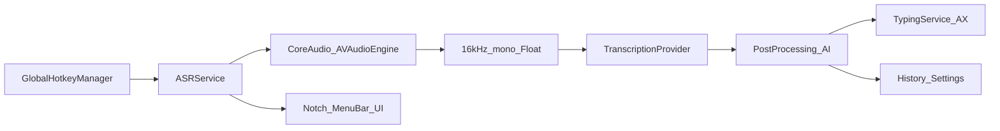
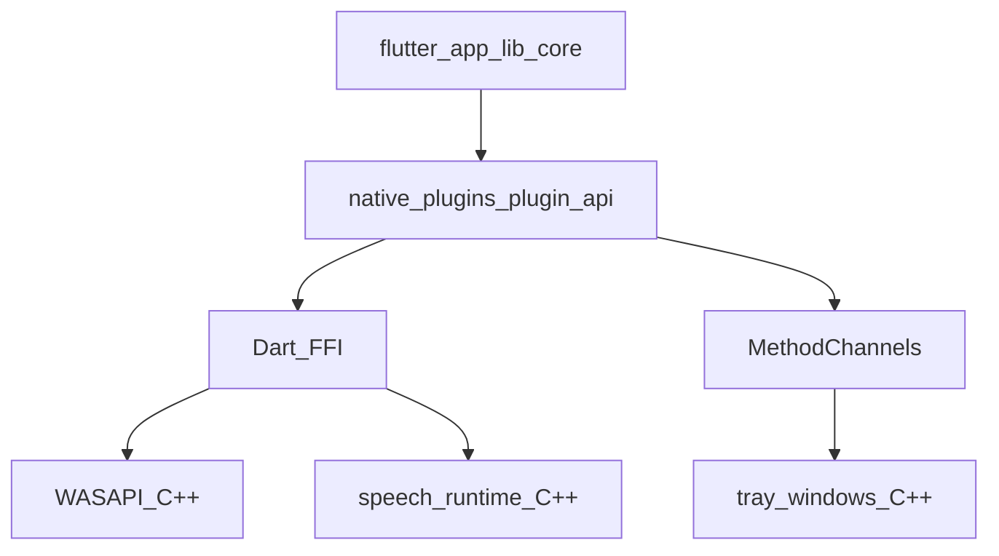
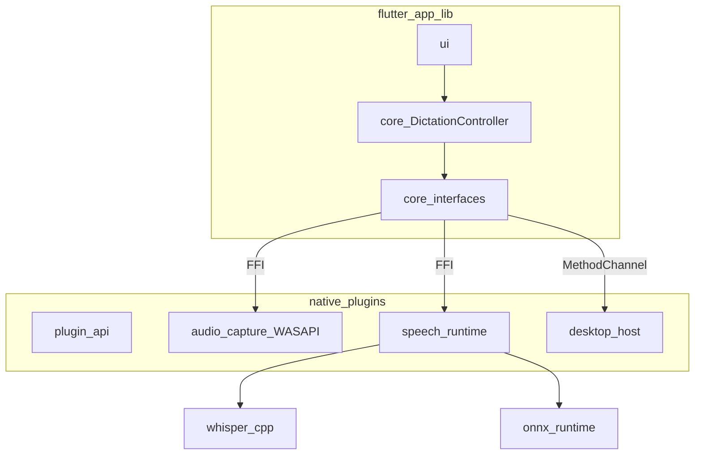

# FluidVoice Flutter Windows Migration Plan

## Deliverable (documentation first)

After approval of this plan, write design docs under `[docs/](docs/)` (not only a root file):

- `[docs/ARCHITECTURE.md](docs/ARCHITECTURE.md)`
- `[docs/WINDOWS_PORT_PLAN.md](docs/WINDOWS_PORT_PLAN.md)`
- `[docs/PLUGIN_API.md](docs/PLUGIN_API.md)`
- `[docs/BUILDING_WINDOWS.md](docs/BUILDING_WINDOWS.md)`
- `[docs/CONTRIBUTING.md](docs/CONTRIBUTING.md)`

No application/Win32 implementation in that docs step. Coding later must follow the gate below.

## Hard gate before any Windows API code

1. Create Flutter architecture skeleton under `flutter_app/`.
2. Define **all Dart interfaces and core managers** in `flutter_app/lib/core/`.
3. Flutter knows **WHAT** it needs; Windows plugins know **HOW**.
4. **No business logic in C++** — dictation flow, settings, history, AI routing, hotkey state machine stay in Dart.
5. Do **not** implement WASAPI, hooks, UIA, or whisper bindings until the abstraction layer exists.

---

## Current architecture (repository facts)

FluidVoice is a **native macOS 15+ SwiftUI dictation app**. There is **no Flutter, Dart, Windows CMake, or Visual Studio project** in this tree. This checkout is still the macOS product.




**Entry / orchestration**

- `[Sources/Fluid/fluidApp.swift](Sources/Fluid/fluidApp.swift)` — `@main` SwiftUI app
- `[Sources/Fluid/AppDelegate.swift](Sources/Fluid/AppDelegate.swift)` — logging, analytics, updates, local API, lifecycle
- `[Sources/Fluid/ContentView.swift](Sources/Fluid/ContentView.swift)` — large workflow coordinator
- `[Sources/Fluid/Services/AppServices.swift](Sources/Fluid/Services/AppServices.swift)` — lazy service container
- `[Sources/Fluid/Services/ASRService.swift](Sources/Fluid/Services/ASRService.swift)` — capture + provider selection + streaming


| Layer       | Path                                 | Role                                                   |
| ----------- | ------------------------------------ | ------------------------------------------------------ |
| UI          | `Sources/Fluid/UI`, `Views`, `Theme` | Settings, onboarding, history, overlays                |
| Services    | `Sources/Fluid/Services`             | ASR, hotkeys, typing, AI, tray, meeting STT, local API |
| Persistence | `Sources/Fluid/Persistence`          | Settings, history, audio, keychain, backup             |
| Networking  | `Sources/Fluid/Networking`           | AI providers, model downloads                          |
| Models      | `Sources/Fluid/Models`               | Hotkeys and shared types                               |
| Native C    | `Sources/CoreAudioCaptureSupport`    | CoreAudio IO + PCM ring buffer                         |


**Core product loop:** global hotkey → mic capture → 16 kHz mono PCM → `TranscriptionProvider` → punctuation/dictionary/AI → clipboard or focused-app injection → history/overlay/tray.

## Build system

- **Primary:** Xcode `[Fluid.xcodeproj](Fluid.xcodeproj)` (scheme `Fluid`, app `FluidVoice`)
- **SPM:** `[Package.swift](Package.swift)` — Swift 5.9, `.macOS("15.0")`
- **Script:** `[build.sh](build.sh)`
- **Lint:** `[.swiftlint.yml](.swiftlint.yml)`
- **CI:** macOS Xcode workflows only
- **Not present:** Flutter, CMake, VS solution

## Dependencies

From `[Package.swift](Package.swift)`: FluidAudio (CoreML ASR), TranscribeCpp/Whisper, DynamicNotchKit, AppUpdater, PromiseKit, PostHog. System: AppKit/SwiftUI, CoreAudio/AVFoundation, Speech, CoreML, AX/Carbon, Network, Keychain, ServiceManagement. Models downloaded at runtime (GGUF / CoreML). License: **GPLv3**. Fluid Intelligence is private / out of repo.

## Swift / macOS-only (must replace)


| Capability                          | Key files                                         | Windows HOW (after Dart WHAT)                          |
| ----------------------------------- | ------------------------------------------------- | ------------------------------------------------------ |
| UI / lifecycle                      | `fluidApp`, `AppDelegate`, `ContentView`, `UI/*`  | Flutter UI + MethodChannel window host                 |
| Tray / overlay                      | `MenuBarManager`, `NotchOverlayManager`           | MethodChannel tray + always-on-top window              |
| Hotkeys                             | `GlobalHotkeyManager`                             | Native hooks; **state machine in Dart**                |
| Text inject / selection             | `TypingService`, `TextSelectionService`           | UIA + `SendInput` behind Dart interface                |
| Audio capture                       | `ASRService`, `DirectCoreAudioInput`, CoreAudio C | WASAPI FFI pipeline (see below)                        |
| STT engines                         | Apple/FluidAudio/Whisper providers                | Unified `speech_runtime` (not per-model plugins)       |
| Secrets / startup / media / updates | Keychain, SMAppService, MediaRemote, AppUpdater   | Credential Manager, startup entry, SMTC, later updater |


## Reusable logic → `flutter_app/lib/core/` (Dart)

Port **behavior and schemas** into Dart core (not Swift binaries):

- Transcription + AI provider **interfaces**
- Spoken punctuation / literal formatting
- Dictation AI post-processing + OpenAI-compatible client / thinking parsers
- History, dictionary, backup, settings models
- Local API router/controllers/models (transport later in Dart HTTP)
- Hotkey **state machine** semantics
- Whisper download/cache concepts as speech_runtime backend config

---

## Target layout (committed)

```text
flutter_app/
  lib/
    core/                    # Dart business core — NOT C++
      dictation_controller.dart
      app_state.dart
      hotkey_state_machine.dart
      history_manager.dart
      settings_manager.dart
      interfaces/
        audio_capture.dart
        transcription_provider.dart
        ai_provider.dart
        speech_engine.dart
        text_injector.dart
        hotkey_source.dart
        tray_host.dart
        ...
    ui/
    main.dart

native_plugins/
  plugin_api/                # shared headers / contracts for FFI + channels
  audio_capture/             # WASAPI + ring buffer + worker → Dart Stream (FFI)
  speech_runtime/            # ONE engine facade for the app
    whisper_cpp/
    onnx_runtime/
    future_models/
  input/                     # hooks, UIA/SendInput (FFI or channel as appropriate)
  desktop_host/              # tray, window management (MethodChannel)

docs/
  ARCHITECTURE.md
  WINDOWS_PORT_PLAN.md
  PLUGIN_API.md
  BUILDING_WINDOWS.md
  CONTRIBUTING.md
```

`lib/core` is **Flutter/Dart application core**. It is not a native C++ core.

### Core contents (explicit)

- `DictationController`
- `TranscriptionProvider` interface
- `AIProvider` interface
- `HistoryManager`
- `SettingsManager`
- `HotkeyStateMachine`
- App state

Example contract style:

```dart
abstract class AudioCapture {
  Stream<AudioChunk> get audioStream;
  Future<void> start();
  Future<void> stop();
}
```

Windows implements these interfaces; UI and controllers only depend on abstractions.

### Unified speech runtime (not per-model plugins)

Do **not** structure as `plugins/whisper`, `plugins/onnx`, etc. exposed separately to the app.

App calls:

```dart
speechEngine.transcribe(audio);
```

Internally `native_plugins/speech_runtime/` may contain `whisper_cpp`, `onnx_runtime`, `future_models`. The Dart-facing API stays one `SpeechEngine` / transcription facade.

### IPC layer (required)




| Transport          | Use for                                                           | Do not use for      |
| ------------------ | ----------------------------------------------------------------- | ------------------- |
| **Dart FFI**       | WASAPI audio, whisper.cpp / speech_runtime, other high-rate paths | —                   |
| **MethodChannels** | settings bridge, tray, window management                          | **audio streaming** |


Audio must not cross MethodChannels.

### WASAPI plugin design (forced)

```text
WASAPI Capture Thread
        →
Lock-free Ring Buffer
        →
Audio Worker Thread
        →
Dart Stream (FFI)
```

Do **not** call into Dart directly from the WASAPI callback. GC pauses will eventually drop or jitter audio. Capture thread only writes the ring buffer; worker formats/resamples and exposes chunks to Dart via FFI-backed stream.

### Architecture principle

- Flutter/Dart: WHAT + all business logic
- C++ plugins: HOW for OS/audio/inference only
- No dictation/AI/settings/history logic in C++

---

## Target runtime architecture




**Stack defaults**

- Flutter Windows desktop; product UX preserved
- MVP STT: Whisper GGUF behind `speechEngine.transcribe`
- MVP AI: OpenAI-compatible HTTP in Dart; Fluid Intelligence out of scope
- Persistence: AppData JSON + Credential Manager
- Overlay: always-on-top window; tray via MethodChannel
- Parakeet-class / ONNX: later backends under `speech_runtime` only

---

## Phased migration

### Phase 0 — Docs + Dart core skeleton (blocking)

- Write `docs/*` design set
- Scaffold `flutter_app/` with `lib/core/` interfaces and managers (stubs OK)
- Document Plugin API (FFI vs MethodChannel) in `PLUGIN_API.md`
- **No Win32/WASAPI/whisper implementation yet**

### Phase 1 — Native HOW behind existing interfaces

- WASAPI: capture thread → lock-free ring → worker → Dart Stream (FFI)
- Hotkey source native events → Dart `HotkeyStateMachine`
- `speech_runtime` with whisper_cpp backend; app still calls `speechEngine.transcribe`
- Tray/windows via MethodChannel
- Text inject behind Dart interface
- Basic settings/history/overlay MVP

### Phase 2 — Product parity (non-Apple)

- Rewrite/write mode, Windows command mode, meeting/file decode, local HTTP API, model download, analytics, launch-at-login, media pause
- Streaming/chunked preview as speech_runtime capabilities allow

### Phase 3 — More backends + polish

- Add `onnx_runtime` under `speech_runtime` without changing app call sites
- Per-app routing, audio history export, installer/updater
- Feature parity checklist vs macOS README feature set

### Testing

- Port intent of integration tests (audio convert, hotkey semantics, LLM shaping, e2e)
- Manual matrix: Notepad/Word/Chrome/Teams, multi-monitor, device switch, long dictation

### Non-goals (initial)

- CoreML / Apple Speech on Windows
- Fluid Intelligence private runtime
- Notch UI
- Per-model top-level plugins
- Business logic in C++
- MethodChannel audio

---

## Docs to write on approval

Expand this plan into:

1. **ARCHITECTURE.md** — layers, `lib/core` vs `native_plugins`, IPC rules, WASAPI pipeline
2. **WINDOWS_PORT_PLAN.md** — current macOS analysis + phased port
3. **PLUGIN_API.md** — Dart interfaces, FFI symbols, MethodChannel methods, speech_runtime facade
4. **BUILDING_WINDOWS.md** — Flutter + MSVC/CMake native build
5. **CONTRIBUTING.md** — where logic belongs, PR expectations, no Win32 spaghetti

Suggested order when coding later: docs (if not done) → `lib/core` interfaces → `plugin_api` → WASAPI FFI → speech_runtime → desktop MethodChannels → UI wiring.